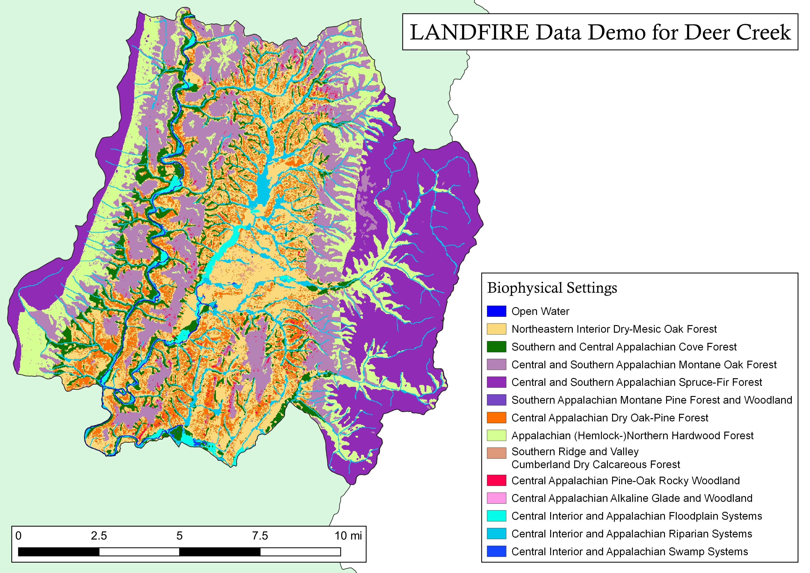
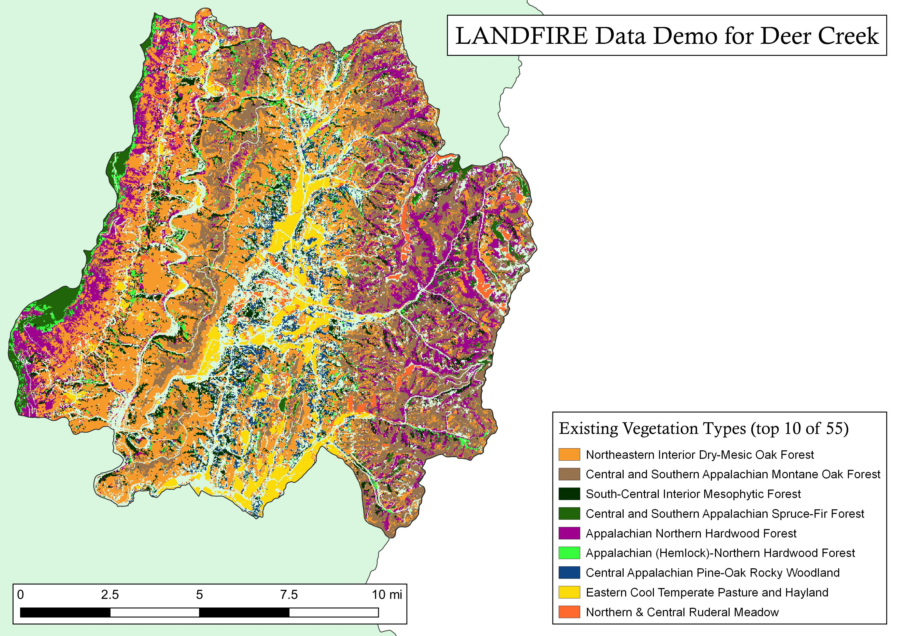
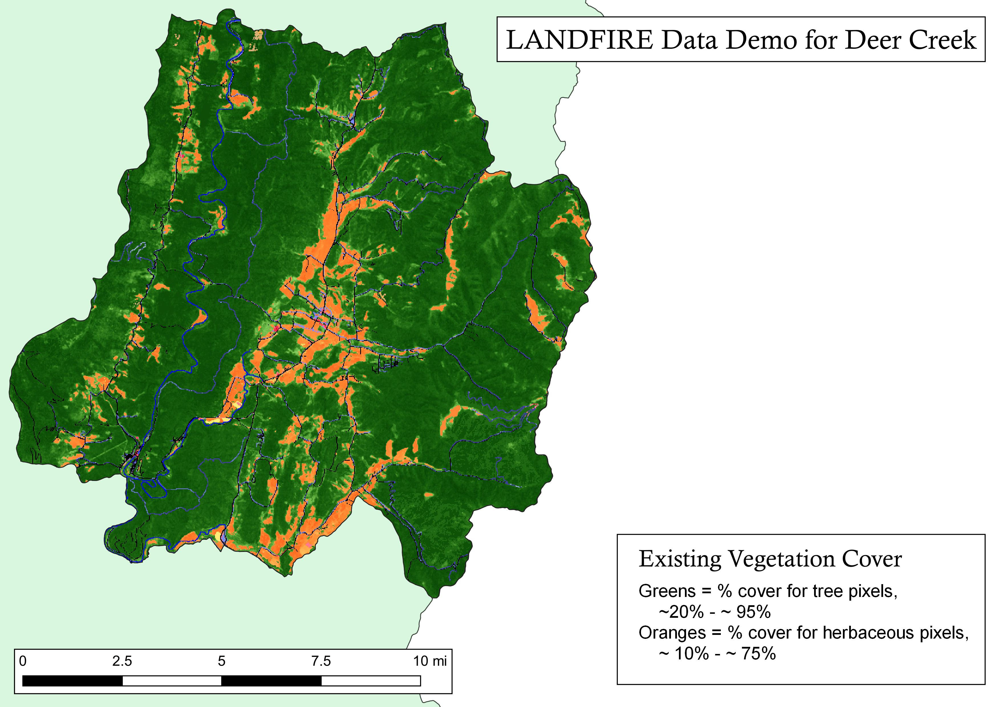
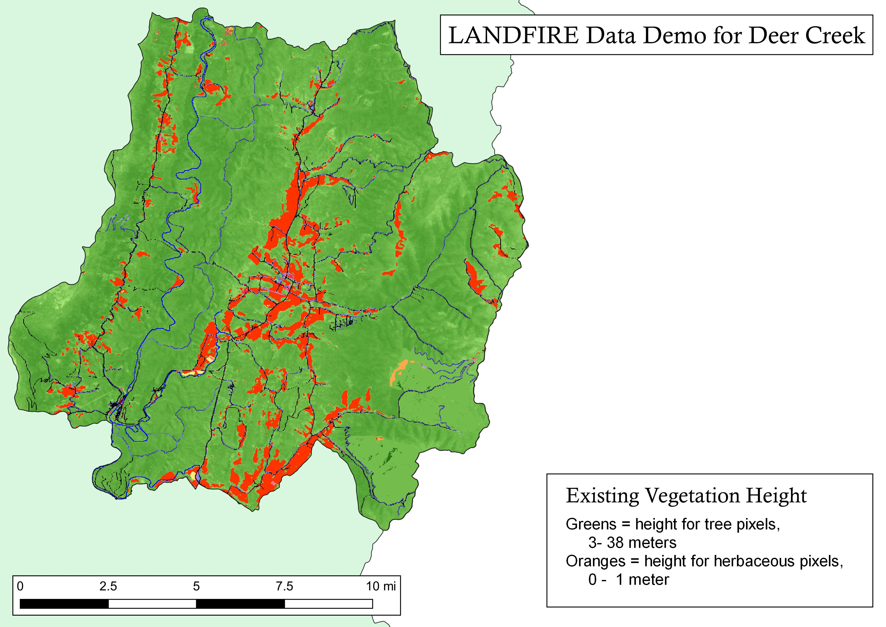
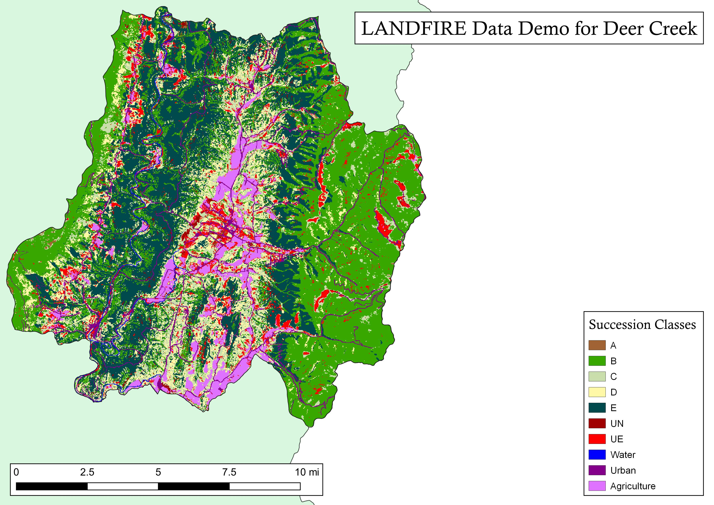

Jan 3rd:
* download and extract all data
* project, crop, mask as needed
* make maps
* if time add FBFM40 stuff...may be a pain


Jan 10th:
* turn this into Tufte?
* GitHub this thing--share
* document what's happening
* think to other landscapes and automation


# Prep this thing

**Libraries**
```{r libraries, message=FALSE, warning=FALSE, include=FALSE}
library(tidyverse)
library(sf)
library(raster)
library(tmap)
library(ggthemes)
library(ggplot2)
library(dplyr)
library(foreign)
library(tmap)
library(igraph)
library(htmlwidgets)
library(chorddiag)

```

**Read in and project shapefile to LF projection**

```{r read shape, message=FALSE, warning=FALSE, include=FALSE}
shp <- st_read("./DATA/deerCreek.shp") %>% 
  st_transform(crs = "+proj=aea +lat_0=23 +lon_0=-96 +lat_1=29.5 +lat_2=45.5 +x_0=0 +y_0=0 +datum=NAD83 +units=m +no_defs") %>%
  st_union() %>%
  st_sf()
```

# Location

```{r locator map, echo=FALSE, message=FALSE, warning=FALSE}
library(tmap)

# toggle tmap mode to interactive viewing
tmap_mode("view")

# read area of interest shapefile
shp <- st_read("./DATA/deerCreek.shp") %>%
  st_transform(5072) %>%
  st_union() %>%
  st_sf()

# create a quick interactive map
quickmap <- qtm(shp, borders = "darkgreen", fill = "seagreen3")

quickmap

# save the map
# due to a bug in tmap, we need to change the working directory to OUTPUTS folder
# then switch it back when we are done saving
old.wd <- getwd()
setwd(paste0(getwd(), "/OUTPUTS"))
tmap_save(tm = quickmap, filename = "aoi_reference_map.html")
setwd(old.wd)
```

# Data download

Obtained the following datasets from the LANDFIRE Data Download Site (https://landfire.gov/viewer/viewer.html) on January 3, 2021:

* EVC 210
* EVH 210
* FB40_21 210
* EVT 200
* BpS 200--tif and attributes-OK
* SCLASS 200

Data products version table: https://landfire.gov/comparison_table.php

# Maps and Charts

## BpS


```{r bps spatial, message=FALSE, warning=FALSE, include=FALSE}
# process BpS 
    bps <- raster("./DATA/US_200BPS/us_200bps/hdr.adf") %>%
      crop(shp) %>%
      mask(shp)
    writeRaster(bps, 
                "./OUTPUTS/bps_aoi_crop.tif", 
                overwrite = T, 
                format="GTiff", 
                options=c('TFW=YES'), 
                datatype = "INT2S")

    bps_x <- bps %>%
      raster::extract(shp) %>%
      unlist() %>%
      table(dnn = "ID") %>%
      as.data.frame() %>%
      arrange(desc(Freq)) %>%
      mutate_all(as.character) %>%
      mutate_all(as.integer) %>%
      left_join(levels(bps)[[1]], by = "ID") %>%
      transmute(VALUE = ID,
                COUNT = Freq,
                BPS_NAME = BPS_NAME %>%
                  as.character() %>%
                  as.factor(),
                # GROUPNAME = GROUPNAME %>%
                #   as.character() %>%
                #   as.factor(),
                GROUPVEG = GROUPVEG,
                acres = (Freq * 900 / 4046.86),
                hectare = (Freq * 900 / 10000),
                rel_percent = (Freq / sum(Freq)) * 100,
                RED = RED,
                GREEN = GREEN,
                BLUE = BLUE,
                R = R,
                G = G,
                B = B)
## write csv for fun, .dbf for use in ArcGIS
    write.csv(bps_x, "./OUTPUTS/bps_aoi_attributes.csv")
    write.dbf(bps_x, "./OUTPUTS/bps_aoi_crop.tif.vat.dbf")
    
## BpS color file for use in QGIS
    BpSColorFile <- bps_x %>%
      add_column(z = 255) %>%
      dplyr::select(VALUE,
             R,
             G,
             B,
             z,
             BPS_NAME) 
    write.table(BpSColorFile, file = "./OUTPUTS/BpSColorFile.txt", sep = ",",
                row.names = FALSE, col.names = FALSE, quote = FALSE)
    

```


Bar Chart
```{r bps bar, echo=FALSE, message=FALSE, warning=FALSE}
# read bps attribute table .csv and summarize
bpsname <- read.csv(file = "./OUTPUTS/bps_aoi_attributes.csv") %>%
  group_by(BPS_NAME) %>%
  summarize(acres = sum(acres),
            hectare = sum(hectare),
            rel_percent = sum(rel_percent)) %>%
  arrange(desc(rel_percent)) %>%
  top_n(n = 10, wt = rel_percent)

# plot
bpsChart <- 
  ggplot(data = bpsname, aes(x = BPS_NAME, y = rel_percent)) +
  geom_bar(stat = "identity") +
  labs(
    title = "Top 10 Biophysical Settings for Deer Creek Landscape",
    subtitle = "Represents dominant vegetation systems pre-European colonization",
    caption = "Represents ~95% of the landscape. \nData from landfire.gov.",
    x = "",
    y = "Percent of landscape") +
  scale_x_discrete(limits = rev(bpsname$BPS_NAME)) +
  coord_flip() +
  theme_bw()

bpsChart

# if the plot looks good, save it
ggsave("./OUTPUTS/bpsChart.png", width = 12, height = 5)
```


Map
```{r bps map, echo=FALSE, message=FALSE, warning=FALSE, out.width='100%'}

```


## EVT


```{r evt spatial, message=FALSE, warning=FALSE, include=FALSE}
# EVT
    evt <- raster("./DATA/US_200EVT/us_200evt/hdr.adf") %>%
      crop(shp) %>%
      mask(shp)
    writeRaster(evt, 
                "./OUTPUTS/evt_aoi_crop.tif", 
                overwrite = T, format="GTiff", 
                options=c('TFW=YES'), 
                datatype = "INT2S")
    evt_x <- evt %>%
      raster::extract(shp) %>%
      unlist() %>%
      table(dnn = "ID") %>%
      as.data.frame() %>%
      arrange(desc(Freq)) %>%
      mutate_all(as.character) %>%
      mutate_all(as.integer) %>%
      left_join(levels(evt)[[1]], by = "ID") %>%
      transmute(VALUE = ID,
                COUNT = Freq,
                EVT_NAME = EVT_NAME,
                EVT_FUEL_N = EVT_FUEL_N,
                EVT_LF = EVT_LF,
                EVT_PHYS = EVT_PHYS,
                EVT_GP_N = EVT_GP_N,
                EVT_ORDER = EVT_ORDER,
                EVT_CLASS = EVT_CLASS,
                EVT_SBCLS = EVT_SBCLS,
                acres = (Freq * 900 / 4046.86), # Freq is count of 30x30m or 900m^2 pixels, convert to acres
                hectare = (Freq * 900 / 10000),
                rel_percent = (Freq / sum(Freq)) * 100,
                RED = RED,
                GREEN = GREEN,
                BLUE = BLUE,
                R = R,
                G = G,
                B = B                )
    write.csv(evt_x, "./OUTPUTS/evt_aoi_attributes.csv")
    write.dbf(evt_x, "./OUTPUTS/evt_aoi_crop.tif.vat.dbf")
    
    ## EVT color file for use in QGIS
    EVTColorFile <- evt_x     %>%
      add_column(z = 255)     %>%
      dplyr::select(VALUE,
                    R,
                    G,
                    B,
                    z,
                    EVT_NAME) 
    
    
    write.table(EVTColorFile, file = "./OUTPUTS/EVTColorFile.txt", sep = ",",
                row.names = FALSE, col.names = FALSE, quote = FALSE)
```

Chart
```{r evt bar, echo=FALSE, message=FALSE, warning=FALSE}
evtname <- read.csv(file = "./OUTPUTS/evt_aoi_attributes.csv") %>%
  group_by(EVT_NAME) %>%
  summarize(acres = sum(acres),
            hectare = sum(hectare),
            rel_percent = sum(rel_percent)) %>%
  arrange(desc(rel_percent)) %>%
  top_n(n = 10, wt = rel_percent)

# plot
evtChart <-
  ggplot(data = evtname, aes(x = EVT_NAME, y = rel_percent)) +
  geom_bar(stat = "identity") +
  labs(
    title = "Top 10 Existing Vegetation Types for Deer Creek Landscape",
    subtitle = "Represents dominant vegetation systems ca2016",
    caption = "Represents ~75% of the landscape. There are 55 EVTs total. \nData from landfire.gov.",
    x = "",
    y = "Percent of landscape") +
  scale_x_discrete(limits = rev(evtname$EVT_NAME)) +
  coord_flip() +
  theme_bw()

evtChart

# save the plot
ggsave( "./OUTPUTS/evtname_barplot.png", width = 12, height = 5)
```

Map
```{r evt map, echo=FALSE, message=FALSE, warning=FALSE, out.width='100%'}

```


## EVC

Map data and attribute table
```{r evc spatial, message=FALSE, warning=FALSE, include=FALSE}
# EVC
    evc <- raster("./DATA/US_210EVC/us_210evc/hdr.adf") %>%
      crop(shp) %>%
      mask(shp)
    writeRaster(evc, 
                "./OUTPUTS/evc_aoi_crop.tif", 
                overwrite = T, 
                format="GTiff", 
                options=c('TFW=YES'), 
                datatype = "INT2S")
    evc_x <- evc %>%
      raster::extract(shp) %>%
      unlist() %>%
      table(dnn = "ID") %>%
      as.data.frame() %>%
      arrange(desc(Freq)) %>%
      mutate_all(as.character) %>%
      mutate_all(as.integer) %>%
      left_join(levels(evc)[[1]], by = "ID") %>%
      transmute(VALUE = ID,
                COUNT = Freq,
                CLASSNAMES = CLASSNAMES,
                acres = (Freq * 900 / 4046.86),
                hectare = (Freq * 900 / 10000),
                rel_percent = (Freq / sum(Freq)) * 100,
                RED = RED,
                GREEN = GREEN,
                BLUE = BLUE,
                R = R,
                G = G,
                B = B )
    
    write.csv(evc_x, "./OUTPUTS/evc_aoi_attributes.csv")
    write.dbf(evc_x, "./OUTPUTS/evc_aoi_crop.tif.vat.dbf")
    
    ## EVC color file for use in QGIS
    EVCColorFile <- evc_x     %>%
      add_column(z = 255)     %>%
      dplyr::select(VALUE,
                    R,
                    G,
                    B,
                    z,
                    CLASSNAMES) 
    
    
    write.table(EVCColorFile, file = "./OUTPUTS/EVCColorFile.txt", sep = ",",
                row.names = FALSE, col.names = FALSE, quote = FALSE)

```


Chart
```{r evc chart, echo=FALSE, message=FALSE, warning=FALSE}
evcname <- read.csv(file = "./OUTPUTS/evc_aoi_attributes.csv")

# create "type" column based on conditions
evcname <- evcname %>% mutate(type = if_else(VALUE %in% 11, "Open Water",
                                             if_else(VALUE %in% 12, "Snow / Ice",
                                                     if_else(VALUE %in% c(13:25), "Developed",
                                                             if_else(VALUE %in% 31, "Barren",
                                                                     if_else(VALUE %in% c(60:70), "Agriculture",
                                                                             if_else(VALUE %in% 32, "Quarries",
                                                                                     if_else(VALUE %in% 100, "Sparse Vegetation",
                                                                                             if_else(VALUE %in% c(101:199), "Tree",
                                                                                                     if_else(VALUE %in% c(201:299), "Shrub",
                                                                                                             if_else(VALUE %in% c(301:399), "Herb",
                                                                                                                     "Other")))))))))))

# create reverse substr() function
revSubstr <- function(x, start, stop) {
  x <- strsplit(x, "")
  sapply(x, 
         function(x) paste(rev(rev(x)[start:stop]), collapse = ""), 
         USE.NAMES = FALSE)  }

# create cover column based on 2nd and 3rd to last values of classname
# if "Other" type, make 0
evcname <- evcname %>% mutate(cover = as.numeric(if_else(VALUE > 100,
                                                         revSubstr(evcname$CLASSNAMES, start = 2, stop = 3),
                                                         "0")))

# create bin breaks for grouping
breaks <- seq(0, 100, 10)
# create intervals for grouping and summarize
# also create factor order for "type"
evcgroup <- evcname %>%
  mutate(interval = cut(cover,
                        breaks, 
                        include.lowest = TRUE, 
                        right = T,
                        labels = c("0-9", "10-19", "20-29", "30-39", "40-49", "50-59", "60-69", "70-79", 
                                   "80-89", "90-100")),
         type = factor(type, levels = c("Tree", "Shrub", "Herb", "Open Water", "Snow / Ice", "Developed", "Agriculture", "Sparse Vegetation", "Barren", "Quarries", "Other"))) %>%
  group_by(type, interval) %>%
  summarize(COUNT = sum(COUNT),
            acres = sum(acres),
            hectare = sum(hectare),
            rel_percent = sum(rel_percent))

# add label and legend names based on condition
evcgroup <- evcgroup %>% mutate(label = if_else(type %in% c("Tree", "Shrub", "Herb"),
                                                paste0(type, " Cover = ", interval, "%"), as.character(type)),
                                legend = if_else(type %in% c("Tree", "Shrub", "Herb", "Open Water"),
                                                 type, as.factor("Other")))

# turn current label order to factors
evclabel.list <- evcgroup$label
evcgroup <- evcgroup %>% mutate(label = fct_rev(factor(label, evclabel.list)))

# create factor level colors for legend
cols <- c("Tree" = "#196F3D", "Shrub" = "#229954", "Herb" = "#52BE80", "Open Water" = "#7FB3D5",
          "Other" = "#808B96")

# plot
evcChart <-
  ggplot(data = evcgroup, aes(x = label, y = rel_percent, fill = legend)) +
  geom_bar(stat = "identity") +
  labs(
    title = "Existing Vegetation Cover for Deer Creek Landscape",
    subtitle = "Represents canopy cover of dominant lifeform ca2016",
    caption = "\nData from landfire.gov.",
    x = "",
    y = "Percent of landscape") +
  scale_fill_manual(values = cols, name = "") +
  coord_flip() +
  theme_bw()

evcChart

# save the plot
ggsave("./OUTPUTS/evcclass_barplot.png", width = 12, height = 9)
```

Map

```{r evc map, echo=FALSE, message=FALSE, warning=FALSE, out.width='100%'}

```


# EVH


```{r evh spatial, message=FALSE, warning=FALSE, include=FALSE}
# EVH 
    evh <- raster("./DATA/US_210EVH/us_210evh/hdr.adf") %>%
      crop(shp) %>%
      mask(shp)
    writeRaster(evh, 
                "./OUTPUTS/evh_aoi_crop.tif", 
                overwrite = T, 
                format="GTiff", 
                options=c('TFW=YES'), 
                datatype = "INT2S")

    evh_x <- evh %>%
      raster::extract(shp) %>%
      unlist() %>%
      table(dnn = "ID") %>%
      as.data.frame() %>%
      arrange(desc(Freq)) %>%
      mutate_all(as.character) %>%
      mutate_all(as.integer) %>%
      left_join(levels(evh)[[1]], by = "ID") %>%
      transmute(VALUE = ID,
                COUNT = Freq,
                CLASSNAMES = CLASSNAMES,
                acres = (Freq * 900 / 4046.86),
                hectare = (Freq * 900 / 10000),
                rel_percent = (Freq / sum(Freq)) * 100,
                RED = RED,
                GREEN = GREEN,
                BLUE = BLUE,
                R = R,
                G = G,
                B = B )
    
    write.csv(evh_x, "./OUTPUTS/evh_aoi_attributes.csv")
    write.dbf(evh_x, "./OUTPUTS/evh_aoi_crop.tif.vat.dbf")
    
    ## EVH color file for use in QGIS
    EVHColorFile <- evh_x     %>%
      add_column(z = 255)     %>%
      dplyr::select(VALUE,
                    R,
                    G,
                    B,
                    z,
                    CLASSNAMES) 
    
    
    write.table(EVHColorFile, file = "./OUTPUTS/EVHColorFile.txt", sep = ",",
                row.names = FALSE, col.names = FALSE, quote = FALSE)
```


Chart
```{r evh chart, echo=FALSE, message=FALSE, warning=FALSE}

# load evh attribute table
evhname <- read.csv(file = "./OUTPUTS/evh_aoi_attributes.csv")

# create "type" column based on conditions
evhname <- evhname %>% mutate(type = if_else(VALUE %in% 11, "Open Water",
                                             if_else(VALUE %in% 12, "Snow / Ice",
                                                     if_else(VALUE %in% c(13:25), "Developed",
                                                             if_else(VALUE %in% 31, "Barren",
                                                                     if_else(VALUE %in% c(60:70), "Agriculture",
                                                                             if_else(VALUE %in% 32, "Quarries",
                                                                                     if_else(VALUE %in% 100, "Sparse Vegetation",
                                                                                             if_else(VALUE %in% c(101:199), "Tree",
                                                                                                     if_else(VALUE %in% c(201:299), "Shrub",
                                                                                                             if_else(VALUE %in% c(301:399), "Herb",
                                                                                                                     "Other"))))))))))) %>%
  mutate(height_m = if_else(type %in% "Tree", (VALUE -100),
                            if_else(type %in% "Shrub", ((VALUE - 200) / 10),
                                    if_else(type %in% "Herb", ((VALUE - 300) / 10), 0))) %>%
           as.character() %>% as.numeric())

# create bin breaks for grouping
breaks <- c(0, 0.1, 0.2, 0.3, 0.4, 0.5, 0.6, 0.7, 0.8, 0.9, 1, 5, 10, 15, 20, 25, 30, 35, 40, 45, 50, 55, 60, 65, 70, 75, 80, 85, 90, 95, 100)

# create intervals for grouping and summarize
# also create factor order for "type"
evhgroup <- evhname %>%
  mutate(interval = cut(height_m,
                        breaks, 
                        include.lowest = TRUE, 
                        right = F,
                        labels = c("0", "0.1-0.2", "0.2-0.3", "0.3-0.4" ,"0.4-0.5", "0.5-0.6", "0.6-0.7", "0.7-0.8", "0.8-0.9", "0.9-1.0", "1-5", "5-10", "10-15", "15-20", "20-25", "25-30", "30-35", "35-40", "40-45", "45-50", "50-55", "55-60", "60-65", "65-70", "70-75", "75-80", "80-85", "85-90", "90-95", "95-100")),
         type = factor(type, levels = c("Tree", "Shrub", "Herb", "Open Water", "Snow / Ice", "Developed", "Agriculture", "Sparse Vegetation", "Barren", "Quarries", "Other"))) %>%
  group_by(type, interval) %>%
  summarise(VALUE = sum(VALUE),
            acres = sum(acres),
            hectare = sum(hectare),
            rel_percent = sum(rel_percent))


# add label and legend names based on condition
evhgroup <- evhgroup %>% mutate(label = if_else(type %in% c("Tree", "Shrub", "Herb"),
                                                paste0(type, " Height = ", interval, " m"), as.character(type)),
                                legend = if_else(type %in% c("Tree", "Shrub", "Herb", "Open Water"),
                                                 type, as.factor("Other")))
# turn current label order to factors
evhlabel.list <- evhgroup$label
evhgroup <- evhgroup %>% mutate(label = fct_rev(factor(label, evhlabel.list)))

# create factor level colors for legend
cols <- c("Tree" = "#196F3D", "Shrub" = "#229954", "Herb" = "#52BE80", "Open Water" = "#7FB3D5",
          "Other" = "#808B96")


# plot
evhChart <-
ggplot(data = evhgroup, aes(x = label, y = rel_percent, fill = legend)) +
  geom_bar(stat = "identity") +
  labs(
    title = "Existing Vegetation Height for Deer Creek Landscape",
    subtitle = "Represents canopy height of dominant lifeform ca2016",
    caption = "\nData from landfire.gov.",
    x = "",
    y = "Percent of landscape") +
  scale_fill_manual(values = cols, name = "") +
  coord_flip() +
  theme_bw()

evhChart

# save plot
ggsave("./OUTPUTS/evhclass_barplot.png", width = 12, height = 9)

```

Map

```{r evh map, echo=FALSE, message=FALSE, warning=FALSE, out.width='100%'}

```


# SCLASS

tested in Arc? Map OK!  Attributes OK!
tested in QGIS?  Map OK! Colorfile OK!

```{r sclass spatial, message=FALSE, warning=FALSE, include=FALSE}
# SCLASS
  

    sclass <- raster("./DATA/US_200SCLASS/us_200sclass/hdr.adf") %>%
      crop(shp) %>%
      mask(shp)
    writeRaster(sclass, 
                "./OUTPUTS/sclass_aoi_crop.tif", 
                overwrite = T, 
                format="GTiff", 
                options=c('TFW=YES'), 
                datatype = "INT2S")

    sclass_x <- sclass %>%
      raster::extract(shp) %>%
      unlist() %>%
      table(dnn = "ID") %>%
      as.data.frame() %>%
      arrange(desc(Freq)) %>%
      mutate_all(as.character) %>%
      mutate_all(as.integer) %>%
      left_join(levels(sclass)[[1]], by = "ID") %>%
      transmute(VALUE = ID,
                COUNT = Freq,
                LABEL = LABEL,
                acres = (Freq * 900 / 4046.86), # Freq is count of 30x30m or 900m^2 pixels, convert to acres
                hectare = (Freq * 900 / 10000),
                rel_percent = (Freq / sum(Freq)) * 100,
                RED = RED,
                GREEN = GREEN,
                BLUE = BLUE,
                R = R,
                G = G,
                B = B)
    
    write.csv(sclass_x, "./OUTPUTS/sclass_aoi_attributes.csv")
    write.dbf(sclass_x, "./OUTPUTS/sclass_aoi_crop.tif.vat.dbf")
    
    ## SCLASS color file for use in QGIS
    SCLASSColorFile <- sclass_x     %>%
      add_column(z = 255)     %>%
      dplyr::select(VALUE,
                    R,
                    G,
                    B,
                    z,
                    LABEL) 
    
    
    write.table(SCLASSColorFile, file = "./OUTPUTS/SCLASSColorFile.txt", sep = ",",
                row.names = FALSE, col.names = FALSE, quote = FALSE)

```

Map (only-no chart)

```{r sclass map, echo=FALSE, message=FALSE, warning=FALSE, out.width='100%'}

```


## Chord

```{r chord, echo=FALSE, message=FALSE, warning=FALSE}


library(chorddiag)
# read bps and evt rasters
bps_r <- raster("./OUTPUTS/bps_aoi_crop.tif")
evt_r <- raster("./OUTPUTS/evt_aoi_crop.tif")

# edit the tables a little bit, mainly names
bps_att <- read.csv(file = "./OUTPUTS/bps_aoi_attributes.csv") %>%
  dplyr::select(VALUE, GROUPVEG, acres) %>%
  rename(BPS_ID = VALUE, bps_acres = acres) %>%
  mutate(GROUPVEG = paste("BPS ", GROUPVEG))

evt_att <- read.csv(file = "./OUTPUTS/evt_aoi_attributes.csv") %>%
  dplyr::select(VALUE, EVT_PHYS, acres) %>%
  rename(EVT_ID = VALUE, evt_acres = acres) %>%
  mutate(EVT_PHYS = paste("EVT ", EVT_PHYS))

# combine rasters
bps2evt <- stack(bps_r, evt_r) %>%
  getValues() %>%
  as.data.frame() %>%
  plyr::count() %>%
  rename(BPS_ID = bps_aoi_crop, EVT_ID = evt_aoi_crop) %>%
  mutate(acres = round((freq * 900 / 4046.8564224))) %>%
  left_join(bps_att) %>%
  left_join(evt_att) %>%
  drop_na()
write.csv(bps2evt, "./OUTPUTS/bps2evt_VEG.csv")


# select specific attributes for chord diagram 
bps2evt_select <- bps2evt %>%
  dplyr::select(GROUPVEG, EVT_PHYS, acres)

# load igraph library and create adjacency matrix
library(igraph)
bps2evt_mx <- as.matrix(as_adjacency_matrix(graph_from_data_frame(bps2evt_select), attr = "acres", names = T))

bps2evt_mx <- bps2evt_mx[c(1:7), c(7:21)] 

#%>% t()

# load chorddiag lobrary and create cord diagram

currentChord <- chorddiag(data = bps2evt_mx,
                          type = "bipartite",
                          groupnamePadding = 10,
                          groupPadding = 3,
                          groupColors = c("#ffffe5","#fff7bc","#fee391","#fec44f","#fe9929","#32784f","#cc4c02","#8c2d04", "#32784f"),
                          groupnameFontsize = 11,
                          showTicks = FALSE,
                          margin=130,
                          tooltipGroupConnector = "    &#x25B6;    ",
                          chordedgeColor = "#B3B6B7")

currentChord

saveWidget(currentChord, "./OUTPUTS/chord.html")
```


## Trying S-class chart

* BpS data does not include BpS model number...will have to estimate.  This landscape is all in MZ 61
* will move to pivot table probably to get current percentages? add in reference for sure

Data wrangling
```{r sclass data, message=FALSE, warning=FALSE, include=FALSE}

bps_r <- raster("./OUTPUTS/bps_aoi_crop.tif")
sclass_r <- raster("./OUTPUTS/sclass_aoi_crop.tif")

df<-data.frame('bps_r'=as.factor(as.matrix(bps_r)), 
               'sclass_r'=as.factor(as.matrix(sclass_r)))
# calculate table
table(df$bps_r, df$sclass_r)

cmbn <- subset(as.data.frame(table(bps_r[],sclass_r[])), Freq != 0)

#install.packages("varhandle")
library(varhandle)

cmbn$Var2 <- unfactor(cmbn$Var2)
cmbn$Var1 <- unfactor(cmbn$Var1)

#bring in s-class labels
cmbn <- left_join(cmbn, 
                  sclass_x %>%
                    dplyr::select(1, 3),
                  by = c("Var2" = "VALUE"))

#bring in bps labels
cmbn <- left_join(cmbn, 
                  bps_x %>%
                    dplyr::select(1, 3),
                  by = c("Var1" = "VALUE"))

write.csv(cmbn, file = "bpsScls.csv")


```

Tryt da chart

```{r sclass charts, echo=FALSE, message=FALSE, warning=FALSE}
bps_scls <- read_csv("OUTPUTS/bpsSclsForCharts.csv")
#View(bps_scls)

bps_scls3 <- bps_scls %>%
  filter(BpS == "Montane Oak Forest" | 
  BpS == "Spruce-Fir Forest" | 
  BpS ==  "Dry-Mesic Oak Forest")

bps_scls3 <- bps_scls3 %>%
  pivot_longer(
    cols = c(`Reference`, `Current`), 
    names_to = "refCur", 
    values_to = "Percent"
    )

## order sclasses, then reverse 'cause I messed up (but maybe this will help someone later)
bps_scls3$Sclass <- factor(bps_scls3$Sclass, levels = c(
  "Regeneration", 
  "Mid-development, open canopy", 
  "Mid-development2, open canopy", 
  "Mid-development, closed canopy", 
  "Late-development, open canopy", 
  "Late-development, closed canopy", 
  "Late-development2, closed canopy",
  "UE", 
  "UN", 
  "Agriculture", 
  "Urban"))
# reverse
factor(bps_scls3$Sclass, levels = rev(levels(bps_scls3$Sclass)))


# make chart.  NOTE lines 56 and 57 where I select the BpS to make the chart for.  Make sure to adjust title, etc.
sclasplot <-
  ggplot(bps_scls3, aes(fill=factor(refCur), y=Percent, x=Sclass)) + 
  geom_col(width = 0.8, position = position_dodge()) +
  coord_flip() +
  #facet_grid(. ~BpS) +
  scale_x_discrete(limits = rev(levels(bps_scls3$Sclass))) +
  labs(
    title = "Succession Classes past and present for the Deer Creek Landscape",
    subtitle = "3 BpSs selected for illustration. Not all succession classes present in all BpSs",
    caption = "Names shortened for clarity.  \nData from landfire.gov.",
    x = "",
    y = "Percent")+
  theme_minimal(base_size = 14)+
  theme(plot.caption = element_text(hjust = 0, face= "italic"), #Default is hjust=1
        plot.title.position = "plot", #NEW parameter. Apply for subtitle too.
        plot.caption.position =  "plot") +
  scale_fill_manual(values = c("#3d4740", "#32a852" ), # present (grey), historical (green)
                    name = " ", 
                    labels = c("Present",
                               "Past")) +
  facet_grid(~BpS) +
    theme(panel.spacing = unit(.05, "lines"),
        panel.border = element_rect(color = "black", fill = NA, size = 1), 
        strip.background = element_rect(color = "black", size = 1))

sclasplot

ggsave("./OUTPUTS/bpsScls.png", width = 12, height = 9)

```


